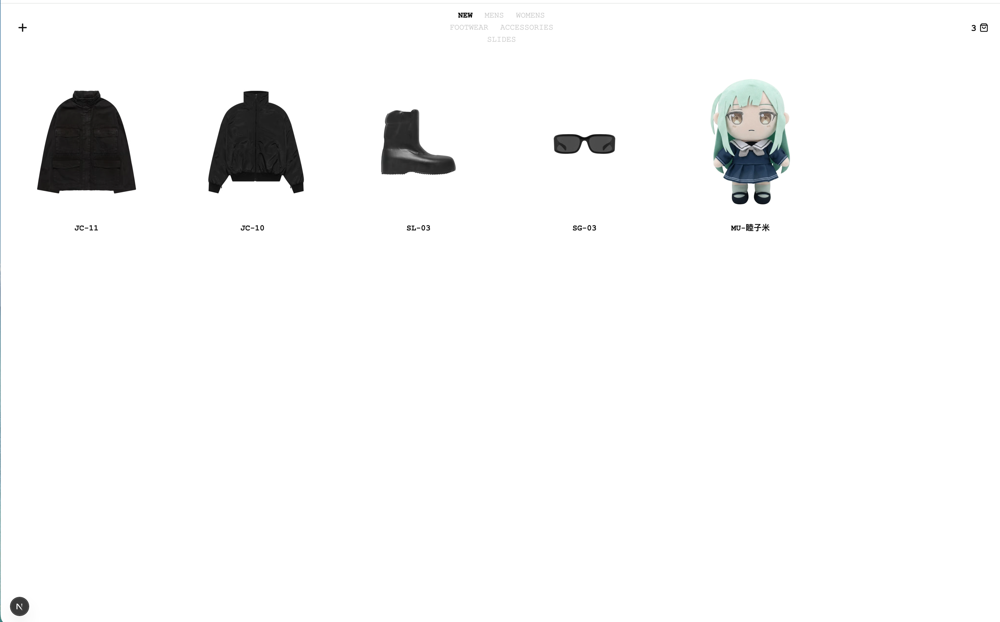
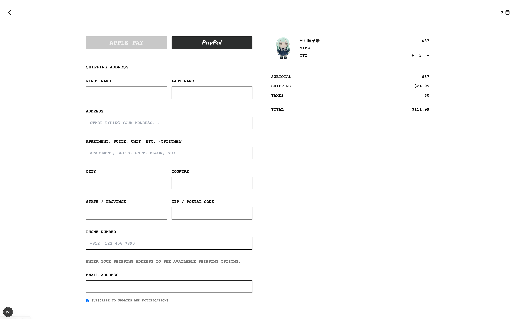
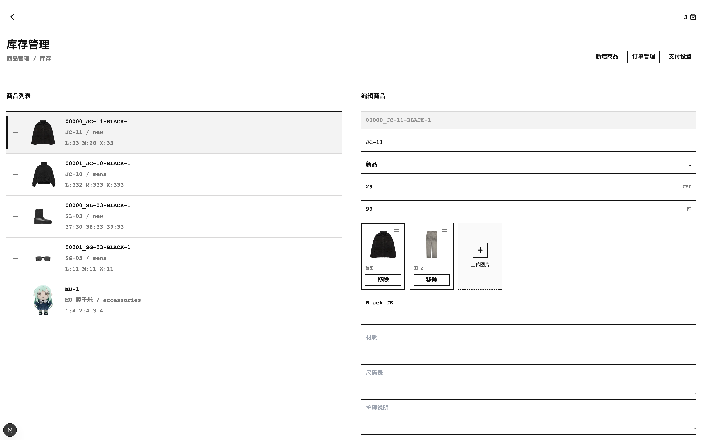

# YEZI Shop

A minimalist e-commerce demo built with Next.js, React 19, and SQLite. Includes a storefront, admin panel, cart/checkout flow, and optional PayPal integration.

Licensed under the [MIT License](./LICENSE).

## Screenshots

| Storefront | Product detail | Cart & checkout |
| --- | --- | --- |
|  |  |  |

## Quick start

**Requirements:** Node.js 20+ (Node.js 24 recommended for built-in `node:sqlite`).

```bash
git clone <your-repo-url>
cd yeezy
npm install
cp .env.example .env.local   # then edit with your credentials
npm run dev
```

Open [http://localhost:3000](http://localhost:3000). If port 3000 is busy, Next.js picks the next available port.

Other scripts:

```bash
npm run build    # production build
npm run start    # run production server
npm run db:seed  # optional seed helper
```

## Configuration

Copy `.env.example` to `.env.local` (or `.env`) and fill in your values. **Do not commit `.env` or `.env.local`** — they are listed in `.gitignore`.

| Variable | Required | Description |
| --- | --- | --- |
| `SHIPPING_FLAT_RATE_USD` | No | Flat shipping fee in USD (default `24.99`). |
| `PAYPAL_CLIENT_ID` | For PayPal | Client ID from [PayPal Developer Dashboard](https://developer.paypal.com/dashboard/). |
| `PAYPAL_SECRET` | For PayPal | Secret for the same PayPal app. |
| `PAYPAL_API_BASE_URL` | For PayPal | Sandbox: `https://api-m.sandbox.paypal.com` · Live: `https://api-m.paypal.com` |
| `PAYPAL_WEBHOOK_ID` | Optional | Webhook ID for server-side capture confirmation. |
| `STRIPE_SECRET_KEY` | Optional | Only needed if Apple Pay via Stripe is enabled. |
| `NEXT_PUBLIC_APPLE_PAY_ENABLED` | No | `true` / `false` (default `false`). |
| `APPLE_PAY_MERCHANT_ID` | Optional | Apple Pay merchant identifier. |

### PayPal setup

1. Create a Sandbox app in the PayPal Developer Dashboard.
2. Set `PAYPAL_CLIENT_ID`, `PAYPAL_SECRET`, and `PAYPAL_API_BASE_URL=https://api-m.sandbox.paypal.com` in `.env.local`.
3. Restart the dev server.
4. PayPal can also be configured in the admin UI at `/admin/payments`; values saved there are stored in the local SQLite database (`data/yezi.db`), not in git.

For production, switch to Live credentials and `https://api-m.paypal.com` only after PayPal app review.

### Default admin account

On first run, a demo admin is created:

```text
Email:    admin@yezi.local
Password: admin123
```

**Change this password before deploying to any shared or public environment.**

## Project layout

```text
app/                 Pages and API routes
components/          React UI components
lib/                 Database, auth, orders, payments
public/products/     Product images
public/uploads/      Admin uploads
doc/                 Docs and screenshots
data/                SQLite database (auto-created, gitignored)
```

More detail: [doc/功能说明.md](./doc/功能说明.md) · [doc/开发文档.md](./doc/开发文档.md)

## Security notes

- `.env.example` contains **placeholder values only**, not real credentials. Never put production secrets in example files.
- `.env`, `.env.local`, and SQLite files under `data/` are gitignored.
- Payment secrets entered in `/admin/payments` are persisted in `data/yezi.db` — back up and protect that file in production.
- The default admin password is for local demo only; rotate it before going live.
- Do not expose PayPal Client Secret or Stripe secret keys in client-side code or public repos.

---

## 中文说明

### 简介

YEZI Shop 是一个极简风格电商演示项目，基于 Next.js、React 19 和 SQLite，包含前台商城、后台管理、购物车/结账，以及可选的 PayPal 支付。

协议：[MIT License](./LICENSE)

### 快速开始

**环境要求：** Node.js 20+（推荐 Node.js 24，可使用内置 `node:sqlite`）。

```bash
git clone <your-repo-url>
cd yeezy
npm install
cp .env.example .env.local   # 复制后填入你自己的配置
npm run dev
```

浏览器访问 [http://localhost:3000](http://localhost:3000)。

### 环境变量配置

将 `.env.example` 复制为 `.env.local`（或 `.env`），填入真实配置。**不要把 `.env` / `.env.local` 提交到 Git**，已在 `.gitignore` 中忽略。

| 变量 | 是否必填 | 说明 |
| --- | --- | --- |
| `SHIPPING_FLAT_RATE_USD` | 否 | 固定运费（美元），默认 `24.99` |
| `PAYPAL_CLIENT_ID` | PayPal 必填 | PayPal 开发者后台的应用 Client ID |
| `PAYPAL_SECRET` | PayPal 必填 | 同一应用的 Secret |
| `PAYPAL_API_BASE_URL` | PayPal 必填 | 沙盒：`https://api-m.sandbox.paypal.com` · 生产：`https://api-m.paypal.com` |
| `PAYPAL_WEBHOOK_ID` | 可选 | Webhook ID，用于服务端确认付款 |
| `STRIPE_SECRET_KEY` | 可选 | 仅启用 Stripe Apple Pay 时需要 |
| `NEXT_PUBLIC_APPLE_PAY_ENABLED` | 否 | 是否启用 Apple Pay，默认 `false` |
| `APPLE_PAY_MERCHANT_ID` | 可选 | Apple Pay 商户 ID |

**PayPal 配置步骤：**

1. 在 [PayPal Developer Dashboard](https://developer.paypal.com/dashboard/) 创建 Sandbox 应用。
2. 在 `.env.local` 中填写 Client ID、Secret 和沙盒 API 地址。
3. 重启开发服务器。
4. 也可在 `/admin/payments` 后台可视化配置；保存后写入本地 SQLite（`data/yezi.db`），不会进入 Git。

`.env.example` 里只有**示例占位符**，不是你的真实配置。生产环境请使用 Live 凭证，并在 PayPal 审核通过后再切换 API 地址。

### 默认管理员

首次启动会自动创建演示管理员：

```text
邮箱：admin@yezi.local
密码：admin123
```

**部署到公网或共享环境前，请务必修改密码。**

### 安全提醒

- 切勿将 PayPal Secret、Stripe 密钥等写入 `.env.example` 或提交到仓库。
- `data/yezi.db` 可能包含后台保存的支付配置，生产环境需妥善保管。
- 登录页已不再显示默认管理员账号，请查阅本文档获取本地演示账号。

### 展示截图

见本文档顶部 [Screenshots](#screenshots) 一节，图片位于 `doc/img/`。
